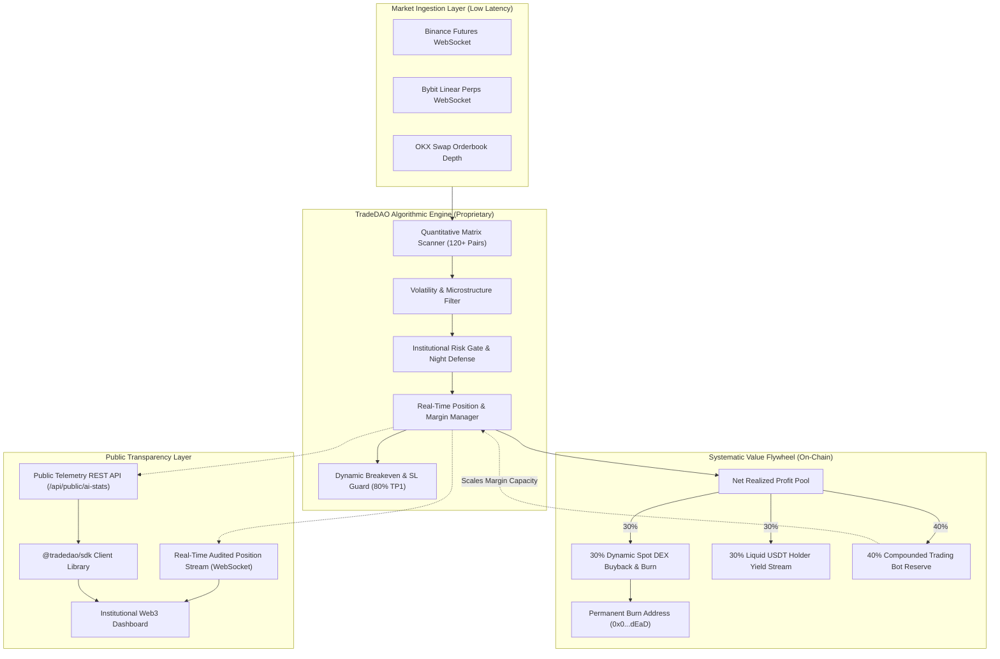

# TradeDAO Protocol

<div align="center">


**Institutional Quantitative Trading Bot Infrastructure & Systematic Revenue Protocol**

[](https://opensource.org/licenses/Apache-2.0)
[](https://trade.hivasigorta.com)
[](https://trade.hivasigorta.com)
[](https://trade.hivasigorta.com)
[](https://trade.hivasigorta.com)
[](./sdk)

[Live Terminal](https://trade.hivasigorta.com) • [Architecture](./docs/ARCHITECTURE.md) • [Risk Management](./docs/RISK_MANAGEMENT.md) • [Value Flywheel](./docs/VALUE_FLYWHEEL.md) • [Tokenomics](./docs/TOKENOMICS.md) • [Telemetry API](./docs/API_SPECIFICATION.md)

</div>

---

## Executive Overview

**TradeDAO** is an institutional-grade quantitative algorithmic trading infrastructure designed to extract systematic alpha across high-liquidity digital asset markets 24 hours a day, 7 days a week. Powered by multi-exchange routing, statistical volatility scanning, and strict risk guardrails, TradeDAO funnels **100% of realized trading performance** directly into a closed-loop economic ecosystem:

1. **30% Dynamic Buyback & Permanent Burn:** Real-time spot market order execution absorbing circulating `$TRDD` supply directly into the dead burn address (`0x000...dEaD`).
2. **30% Liquid USDT Yield Stream:** Continuous, un-locked stablecoin dividend distribution streamed to verified token holders.
3. **40% Trading Bot Reserve Compounding:** Re-injected directly into quantitative position margin to systematically scale position sizing, compounding operational capacity over time.

> **Notice Regarding Proprietary Execution Code:** In accordance with institutional asset protection and quantitative competitive advantage standards, proprietary execution algorithms, signal weights, and private exchange connections remain strictly private. This repository provides the public protocol architecture, technical specifications, smart contract interfaces, mathematical models, and the official public telemetry SDK.

---

## High-Level System Architecture



---

## Core Pillars & Mechanism Design

### 1. Multi-Exchange Execution Matrix
The algorithmic engine maintains low-latency order routing across primary institutional venues (Binance, Bybit, OKX). The scanner continuously parses over **120+ perpetual and spot asset pairs**, identifying statistical divergence, mean-reversion, and momentum breakout patterns with dynamic slippage controls.

### 2. Institutional Risk Guardrails
- **Dynamic Breakeven Armor (80% TP1 Rule):** Stop-loss is automatically shifted to entry price plus round-trip exchange fees (+0.15% fee buffer) once an open position reaches 80% progress toward Take-Profit 1. Winning trades are systematically immunized against market reversal.
- **TP0 Micro-Profit Harvesting:** Positions secure 25% micro partial profit at 50% TP1 progress while immediately cutting risk exposure by 50%.
- **Night Session Defense (22:00 – 06:00 TSI / UTC+3):** Protects capital against shallow overnight orderbook manipulation, low liquidity spikes, and false-wick stop hunts by halting aggressive trade opening during low-depth sessions.
- **Circuit Breakers:** Global portfolio drawdown limits and consecutive stop-loss circuit breakers enforce temporary security halts if market conditions breach statistical variance boundaries.

### 3. Systematic 3-Pillar Value Flywheel
```
Total Net Realized Bot Profit (100%)
├── 30% ──> Spot Market DEX Buyback & Burn ($TRDD permanently destroyed)
├── 30% ──> Liquid USDT Yield Pool (Distributed to qualifying holders)
└── 40% ──> Quantitative Trading Bot Reserve (Compounds active margin capital)
```

For complete mathematical derivations and fee routing specifications, review the [Value Flywheel Specification](./docs/VALUE_FLYWHEEL.md).

---

## Tokenomics ($TRDD)

| Parameter | Specification |
|---|---|
| **Token Name** | TradeDAO Protocol Token |
| **Ticker** | `$TRDD` |
| **Total Supply** | `1,000,000,000 $TRDD` (Fixed / Non-Mintable) |
| **Token Type** | Utility & Deflationary Profit-Sharing |
| **Burn Mechanism** | Programmatic DEX Spot Buybacks routed to Dead Address |
| **Contract Address** | `0x55d398326f99859FF77548524699982783197953` |
| **Burn Address** | `0x000000000000000000000000000000000000dEaD` |
| **DEX Liquidity** | Uniswap V3 / DEX Pools with Automated Liquidity Locks |

Detailed distribution, vesting, and lock schedules are documented in [Tokenomics Specification](./docs/TOKENOMICS.md).

---

## Public Telemetry SDK (`@tradedao/sdk`)

TradeDAO provides an official TypeScript SDK for developers, quantitative auditors, and token holders to consume real-time telemetry and audit performance.

### Installation

```bash
npm install @tradedao/sdk
```

### Quickstart

```typescript
import { TradeDAOClient } from '@tradedao/sdk';

const client = new TradeDAOClient({
  endpoint: 'https://trade.hivasigorta.com'
});

async function main() {
  // 1. Fetch live protocol performance telemetry
  const stats = await client.getPublicStats();
  console.log(`Audited Realized Profit: $${stats.realizedProfit} USDT`);
  console.log(`Tokens Burned: ${stats.totalTokensBurned} $TRDD`);
  console.log(`Win Rate: ${stats.winRate}% across ${stats.totalClosedTrades} trades`);

  // 2. Subscribe to live position updates
  client.subscribePositions((positions) => {
    console.log(`Active Live Positions: ${positions.length}`);
    positions.forEach(p => {
      console.log(`[${p.symbol}] ${p.side} Entry: $${p.entryPrice} | PnL: ${p.pnlPct}%`);
    });
  });
}

main();
```

Explore the complete SDK documentation and examples in the [SDK Directory](./sdk).

---

## Public Telemetry API

All public endpoints are cached via Edge CDN with strict rate limits:

- **`GET /api/public/ai-stats`** — Audited cumulative realized profit, win rates, burn volume, and flywheel reserve metrics.
- **`GET /api/og-signal`** — Dynamic social open-graph telemetry generator for trade auditing.
- **`WSS /`** — Real-time position status stream for authenticated Web3 terminals.

Full endpoint schemas and response types are documented in the [API Specification](./docs/API_SPECIFICATION.md).

---

## Security & Auditing

Security and execution integrity are core foundations of TradeDAO:

- **Cryptographic Web3 Nonce Challenge:** Authentication strictly enforces single-use 5-minute cryptographic nonces (`GET /api/auth/nonce/:address`) to eliminate replay attacks.
- **Air-Gapped Key Encryption:** All exchange connections use authenticated `AES-256-GCM` encryption with ephemeral key derivation. Cleartext credentials are never written to disk or included in backups.
- **Role-Based Telemetry Masking:** Internal exchange parameters and virtual testing flags are stripped at the socket level for public transparency feeds.
- **Responsible Disclosure:** If you discover a vulnerability, please review our [Security Policy](./SECURITY.md).

---

## Repository Structure

```
tradedao-protocol/
├── .github/                 # CI workflows & issue templates
├── docs/                    # Technical whitepaper & architecture specifications
│   ├── ARCHITECTURE.md      # Execution engine topology & latency gates
│   ├── RISK_MANAGEMENT.md   # Dynamic breakeven, night defense, & slippage rules
│   ├── VALUE_FLYWHEEL.md    # Mathematical models for buybacks, yield, and reserve
│   ├── TOKENOMICS.md        # Token distribution, burn mechanics, & contract specs
│   └── API_SPECIFICATION.md # REST and WebSocket telemetry API definitions
├── contracts/               # Smart contract ABIs and interface definitions
│   └── interfaces/          # ITRDDToken, IBuybackBurnVault, IDividendDistributor
├── sdk/                     # Official TypeScript Telemetry Client (@tradedao/sdk)
│   ├── src/                 # Client source code (REST, WebSocket, Types)
│   ├── package.json
│   └── tsconfig.json
├── CONTRIBUTING.md          # Community contribution guidelines
├── SECURITY.md              # Vulnerability disclosure & bug bounty guidelines
├── LICENSE                  # Apache 2.0 Open-Source License
└── README.md                # Executive Protocol Overview (This file)
```

---

## Institutional Disclaimers

TradeDAO operates as a decentralized, autonomous algorithmic infrastructure. Quantitative trading in perpetual derivative markets carries financial risk. Historical win rates and audited metrics displayed through public telemetry feeds do not constitute an absolute guarantee of future performance. Users interacting with smart contracts or `$TRDD` tokens must conduct their own independent due diligence.

---

<div align="center">

**TradeDAO Protocol Foundation**  
*Autonomous Quantitative Trading Infrastructure & Systematic Deflationary Protocol*  
[https://trade.hivasigorta.com](https://trade.hivasigorta.com)

</div>
