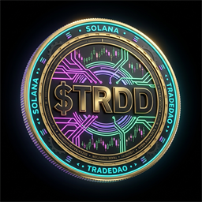

# TradeDAO Protocol ($TRDD) Brand & Token Assets

This directory contains official standardized graphical assets and metadata specifications for the **TradeDAO Protocol Token (`$TRDD`)**.

All assets are optimized for **Web3 Wallets (MetaMask, Trust Wallet, Coinbase Wallet, Rabby, Phantom)**, **Decentralized Exchanges (Uniswap, QuickSwap, SushiSwap, 1inch)**, **Centralized Exchanges (CEXs)**, and **Market Data Aggregators (CoinMarketCap, CoinGecko, DexScreener, GeckoTerminal, PolygonScan)**.

---

## 1. Official Token Specifications

| Parameter | Value |
|---|---|
| **Token Name** | TradeDAO |
| **Token Symbol** | TRDD |
| **Blockchain Network** | Polygon (POS Mainnet) |
| **Chain ID** | `137` |
| **Contract Address** | `0x55d398326f99859FF77548524699982783197953` |
| **Decimals** | `18` |
| **Total Supply** | `1,000,000,000` (Fixed, Non-Mintable) |
| **Official Burn Address** | `0x000000000000000000000000000000000000dEaD` |
| **Official Website** | [https://tradedao.org](https://tradedao.org) |
| **Explorer** | [PolygonScan](https://polygonscan.com/token/0x55d398326f99859FF77548524699982783197953) |
| **Whitepaper & Architecture** | [TradeDAO Protocol Docs](https://github.com/tradedao87-ops/tradedao-protocol) |

---

## 2. Standardized Asset Directory

<div align="center">



</div>

| Asset File | Resolution | Target Usage | Direct Raw CDN URL |
|---|---|---|---|
| [`trdd-token.png`](./trdd-token.png) | 1024 × 1024 | Master High-Res Marketing & CEX Media Kits | `https://raw.githubusercontent.com/tradedao87-ops/tradedao-protocol/main/assets/trdd-token.png` |
| [`trdd-token-512.png`](./trdd-token-512.png) | 512 × 512 | CoinGecko / CoinMarketCap High-Res Listing | `https://raw.githubusercontent.com/tradedao87-ops/tradedao-protocol/main/assets/trdd-token-512.png` |
| [`trdd-token-256.png`](./trdd-token-256.png) | 256 × 256 | Standard CEX / DEX Listing & Token Lists | `https://raw.githubusercontent.com/tradedao87-ops/tradedao-protocol/main/assets/trdd-token-256.png` |
| [`logo.png`](./logo.png) | 256 × 256 | Trust Wallet Assets / Uniswap Tokenlist Spec | `https://raw.githubusercontent.com/tradedao87-ops/tradedao-protocol/main/assets/logo.png` |
| [`trdd-token-128.png`](./trdd-token-128.png) | 128 × 128 | Web3 Wallet Native Modals & Swap Interfaces | `https://raw.githubusercontent.com/tradedao87-ops/tradedao-protocol/main/assets/trdd-token-128.png` |
| [`trdd-token-64.png`](./trdd-token-64.png) | 64 × 64 | Mobile Wallets (MetaMask, Trust Wallet, Rabby) | `https://raw.githubusercontent.com/tradedao87-ops/tradedao-protocol/main/assets/trdd-token-64.png` |
| [`trdd-token-32.png`](./trdd-token-32.png) | 32 × 32 | Block Explorer Table Rows & Micro Favicons | `https://raw.githubusercontent.com/tradedao87-ops/tradedao-protocol/main/assets/trdd-token-32.png` |

---

## 3. Web3 Wallet Integration Guide

### MetaMask / Rabby / Web3 Wallets (Custom Token Addition)

To manually add `$TRDD` to your EVM wallet:
- **Contract Address:** `0x55d398326f99859FF77548524699982783197953`
- **Token Symbol:** `TRDD`
- **Token Decimal:** `18`
- **Network:** Polygon Mainnet (Chain ID `137`)

### Trust Wallet Assets Repository Submission Format

When submitting to the official Trust Wallet Assets repository (`trustwallet/assets`):

```
blockchains/polygon/assets/0x55d398326f99859FF77548524699982783197953/
├── info.json
└── logo.png  <-- (Copy of assets/logo.png, 256x256 PNG, <100KB)
```

**`info.json` structure:**
```json
{
  "name": "TradeDAO",
  "type": "POLYGON",
  "symbol": "TRDD",
  "decimals": 18,
  "website": "https://tradedao.org",
  "description": "Institutional Quantitative Trading Bot Infrastructure & Systematic Revenue Protocol with dynamic 30% Buyback & Burn and 30% Liquid USDT Yield Stream.",
  "explorer": "https://polygonscan.com/token/0x55d398326f99859FF77548524699982783197953",
  "status": "active",
  "id": "0x55d398326f99859FF77548524699982783197953",
  "links": [
    {
      "name": "github",
      "url": "https://github.com/tradedao87-ops/tradedao-protocol"
    }
  ]
}
```

---

## 4. Uniswap Token List Standard (`tokenlist.json`)

The official standard Uniswap/1inch tokenlist definition is maintained at [`assets/tokenlist.json`](./tokenlist.json).

---

## 5. CEX & Listing Platform Guidelines

- **CoinMarketCap / CoinGecko Application:**
  - Submit the official logo using the permanent direct raw GitHub URL:
    `https://raw.githubusercontent.com/tradedao87-ops/tradedao-protocol/main/assets/trdd-token-256.png`
- **Background:** High-definition 3D gold-copper metallic relief with cyan/emerald ambient luminescence, optimized for dark mode interfaces.
- **Aspect Ratio:** Strictly 1:1 (Square).

